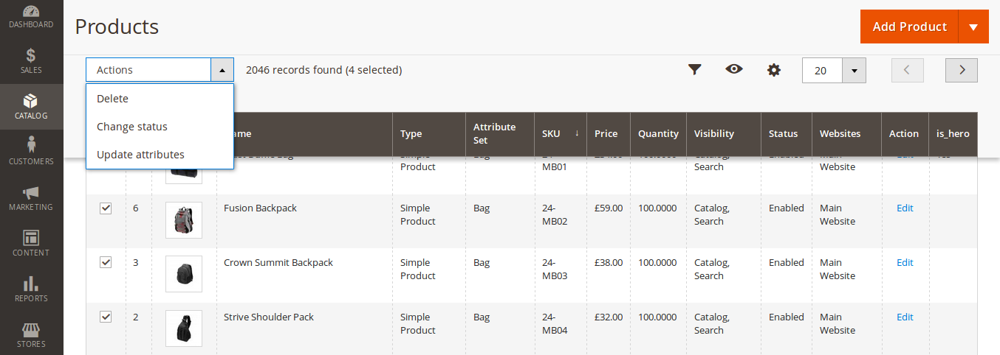
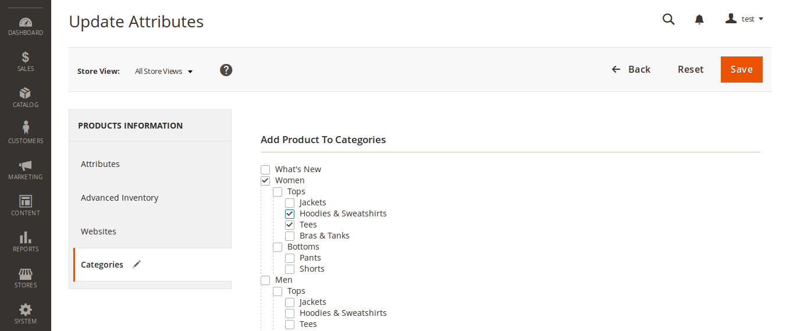
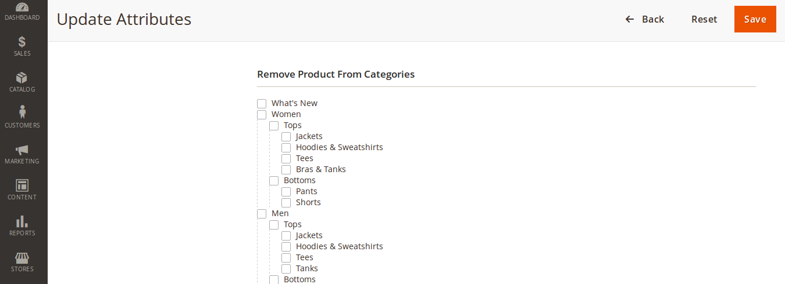

# magento 2 - Add the ability to mass update the products categories, in the product grid.
Add and remove products from a category using  update attribute on the product grids.

## Installation
- composer config repositories.paulmillband-add-products-to-categories-in-admin vcs git@github.com:yorick2/Magento-2-add-products-to-categories-in-admin.git
- composer require paulmillband/m2-admin-products-to-category:dev-master
- composer update 
- php bin/magento module:enable Paulmillband_AdminProductsToCategory
- php bin/magento setup:upgrade
- php bin/magento setup:di:compile

## Instructions
- login to magento admin
- go to catalog > products 
- select your products 
- select 'update attributes' from the drop down
- select the categpries tab
- select the categories to add to or remove from
- hit save

